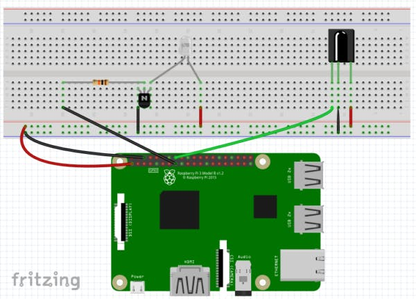

# Raspberry Pi AC Controller (IR)

## Overview

The repository houses code for a basic IR transmitter which is programmed to use
codes that will interact with my AC unit.

## Components

1. Raspberry Pi with WiFi dongle and SD card (case, if you please)
2. Half-size breadboard
3. Jumper cables
3. 1 IR 5mm LED
4. 1 220 Ohm resistor
5. 1 10k Ohm resistor
6. PN2222 transistor
7. IR receiver for testing
8. A minor amount of programming skill

## The System

The AC unit has a hard constraint that it should not be turned on within 3
minutes of turning it off. Let's keep that in mind as we design.

Let's build an API to "press the buttons" on the raspberry pi IR remote.

## Hardware Setup

Refer to the image below, borrowed from [here](https://www.hackster.io/austin-stanton/creating-a-raspberry-pi-universal-remote-with-lirc-2fd581)
for an example layout. I used a Raspberry Pi Model B Rev 2, so the connections were
slightly different.

1. Connect the 3.3V to the positive breadboard rail
2. Connect the ground to the negative breadboard rail
3. Wire up the IR receiver as indicated. I connected it to GPIO 22
4. Wire up the IR LED as indicated. Positive end connects, through a 220 Ohm resistor,
to 3.3V. Negative connects to the collector on the transistor,
while the emitter connects to ground. The base connects, through a 10k Ohm
resistor, to GPIO 23.



## System Setup

Now that you've got your hardware ready to get, set up your Raspberry Pi.
I used an image of Raspbian. You'll need to install some stuff:

```bash
sudo apt-get update
sudo apt-get lirc python2.7 node npm rpi.gpio
sudo npm i -g bower
```

In the `ir/web` folder, run

```bash
bower install
```

to get the JS dependencies.

Now you need to configure the system. I referenced these steps from
[here](https://www.hackster.io/austin-stanton/creating-a-raspberry-pi-universal-remote-with-lirc-2fd581).
Add the following lines to `/etc/modules`

```bash
lirc_dev
lirc_rpi gpio_in_pin=22 gpio_out_pin=23
```

Change your `/etc/lirc/hardware.conf` to

```bash
########################################################
# /etc/lirc/hardware.conf
#
# Arguments which will be used when launching lircd
LIRCD_ARGS="--uinput"
# Don't start lircmd even if there seems to be a good config file
# START_LIRCMD=false
# Don't start irexec, even if a good config file seems to exist.
# START_IREXEC=false
# Try to load appropriate kernel modules
LOAD_MODULES=true
# Run "lircd --driver=help" for a list of supported drivers.
DRIVER="default"
# usually /dev/lirc0 is the correct setting for systems using udev
DEVICE="/dev/lirc0"
MODULES="lirc_rpi"
# Default configuration files for your hardware if any
LIRCD_CONF=""
LIRCMD_CONF=""
######################################################## 
```

Add the following to `/boot/config.txt`

```bash
dtoverlay=lirc-rpi,gpio_in_pin=22,gpio_out_pin=23
```

Now, restart your system

```bash
sudo shutdown -r 0
```

If all goes well, you should be almost configured. If you have issues, refer
to the post I linked above.

The last step is to use `irrecord` (also detailed in link)
to create a configuration for the remote
you want to control. I used it to grab buttons for:
* Power (`BTN_X`)
* Increase Temperature (`BTN_Y`)
* Decrease Temperature (`BTN_Z`)

Update the `/etc/lirc/lircd.conf` with your recording and make sure
the device's name is `airconditoner`, restart `lirc`, and things
should now be working as expected.

## Program Execution

For a quick and dirty execution, run

```bash
python2.7 main.py
```

from the `ir` folder.